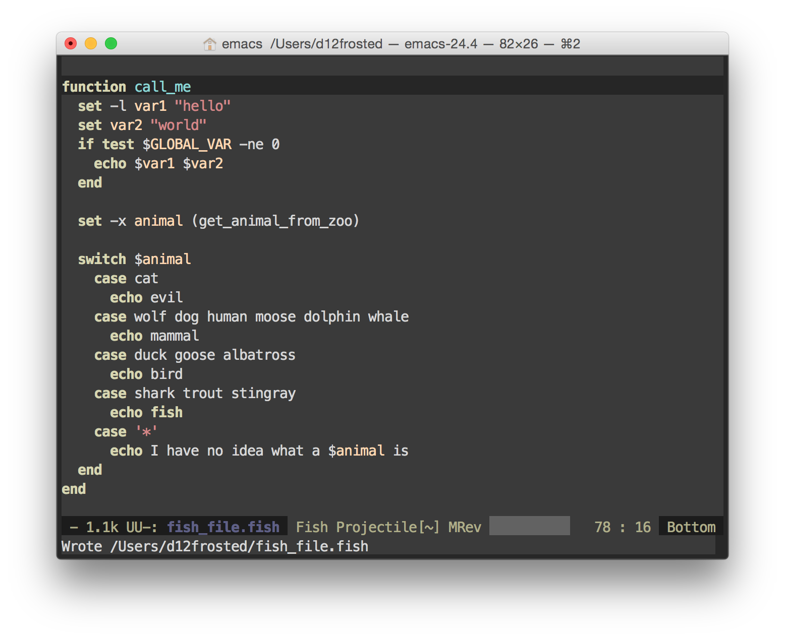

# fish-mode (2)

Major mode for editing fish shell scripts. Lightweight, fast and knows where to put it's `end`.

## Features

Currently `fish-mode` has several features:

* syntax highlighting
    * `$VAR` is highlighted is `sh-mode` manner - only `VAR` part is colored
    * `set [-\flags]? var value` - `var` is also highlighted as variable
* simple indentation that works from first click
    * by default `tab-width` is set to 2, but you might what to configure it by using hooks
    * indentation is made in manner (style) that is used in official documentation, but it also supports some strange written scripts
    * `end` term knows where it belongs to - so no more jumping `end`s.
* support of `comment-dwim`
* `fish` files are associated with `fish-mode` by default

TODO:

* indentation function sets point to the end of indentation

## Contribute

Pull requests are welcome, as well as feature requests and bug reports.
